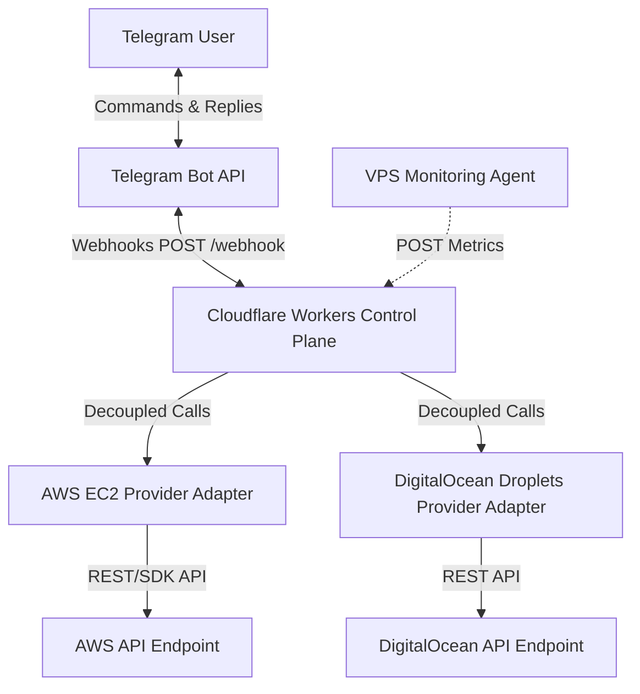

# Architecture Overview - Infrastructure Bot

This Control Plane is built as a production-grade, highly available, and vendor-independent edge service designed to manage virtual infrastructure securely via Telegram.

## System Topology



---

## Key Architectural Decisions

### 1. Cloudflare Workers as Edge Control Plane
* **Zero Infrastructure Overhead**: Runs serverless at the edge, offering global coverage and sub-millisecond response start times.
* **Cost Efficiency**: High free-tier and pay-per-request pricing prevents maintaining dedicated VMs for running the control system.
* **High Availability**: Immune to localized datacenter outages. If one cloud region goes offline, the control plane is unaffected.

### 2. Complete Decoupling of VPS and Control Plane
The Control Plane queries state directly from the Cloud Provider API endpoints (AWS & DigitalOcean REST endpoints). 
* **Zero Dependency**: If a target VPS is completely powered down, locked up, or experiencing network failures, the Control Plane can still query its status, boot it, reboot it, or issue tear-down requests.
* The monitoring data collection runs asynchronously and does not block critical control pathways.

### 3. Provider Abstraction Layer
A unified `CloudProvider` interface decouples the Telegram Command router from cloud vendor SDKs. Adding future provider adapters (such as GCP, Azure, Hetzner) requires implementing the interface and updating the Registry without altering bot command handlers.

### 4. Configuration-Driven Server Registry
To enforce least privilege, prevent command typos, and protect instances from unauthorized discovery, the Control Plane uses a configuration-driven Server Registry.
* **Server Aliases**: Users execute commands on friendly aliases (e.g., `ai-gateway-prod`) rather than raw instance IDs.
* **Registry Schema**: The configuration is stored as a JSON string under the `SERVERS_CONFIG` environment binding:
  ```json
  {
    "ai-gateway-prod": {
      "provider": "aws",
      "region": "ap-south-1",
      "instanceId": "i-0123456789abcdef0"
    },
    "docs-server": {
      "provider": "digitalocean",
      "dropletId": "123456",
      "region": "nyc3"
    }
  }
  ```
* **No Database Dependency**: The registry schema resides in Git-controlled environment variables, enabling full reproducibility and zero database operational overhead.
