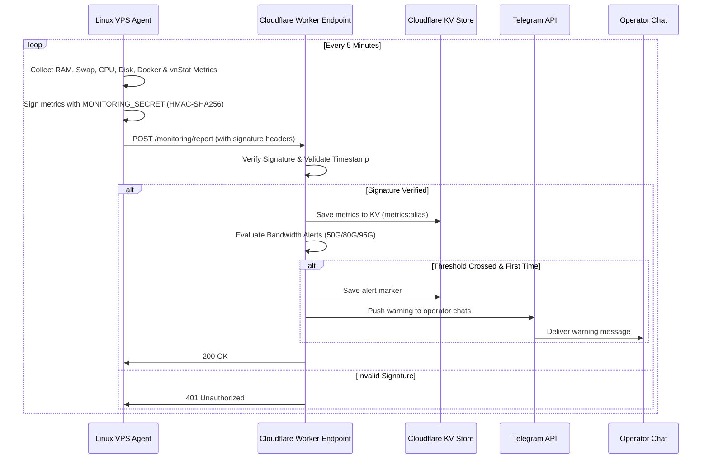

# Monitoring Architecture - Mosabbir Infrastructure Bot

The monitoring layer is designed as a secure, pull/push telemetry framework that monitors infrastructure health without database overhead.

## System Workflow

## Core Components

### 1. Ingestion Endpoint
* **Path**: `/monitoring/report`
* **Protocol**: HTTP POST (JSON Payload)
* **Auth Headers**: 
  * `X-Signature`: HMAC-SHA256 hex string computed over request body.
  * `X-Server-Alias`: The server registration name configured in `SERVERS_CONFIG`.

### 2. Telemetry Invalidation & Storage
* Metrics are saved in a Cloudflare KV namespace (`MONITORING_KV`) under the key `metrics:<alias>`.
* Because Worker execution is stateless, KV is the optimal choice: high write performance, edge-level read speeds, and no database connection pools to exhaust.

### 3. Replay Protection
* The report payload contains an epoch `timestamp` field.
* The ingestion handler computes clock drift (`|now - timestamp|`). If it exceeds `300 seconds` (5 minutes), the Worker rejects the report. This prevents malicious replay of old telemetry payloads.
